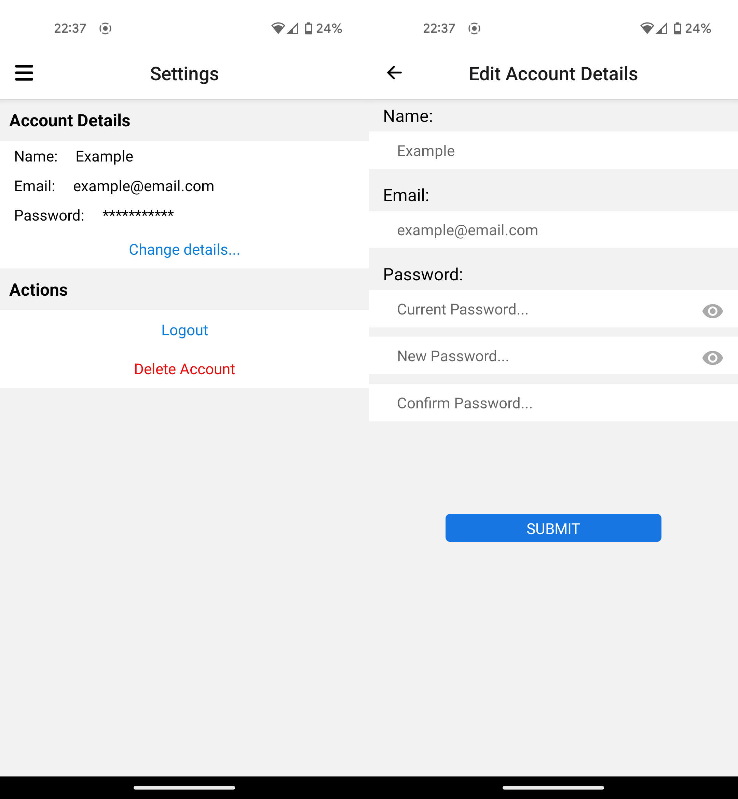

# Finance-Manager

## Description

Introducing your friend in finance. This full-stack application aims to assist you in budgeting for your everyday spending and save money for your well deserved holidays!

### Features

- Add multiple Bank accounts to track spending
- Add Transactions associated with existing bank accounts
- Sign up and Login to access data stored in server from any device
- Track overall spending displayed via graphs

## Tech Stack

### Frontend Client Application

- React Native
- Typescript

### Backend Server and API

- Nodejs & Expressjs
- MongoDB & Mongoose
- JWT Authentication
- Typescript

### Demo

#### Account Screen

#### Signup and Login

